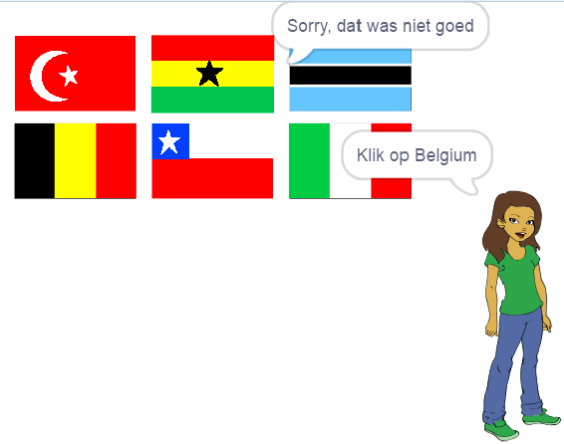

## Controleer het antwoord

Je sprite vraagt de speler nu om op de juiste vlag te klikken. Vervolgens moet het spel controleren of de vlag waarop is geklikt het juiste antwoord is.

--- task ---

Ga terug naar de code van de vlag sprite en voeg een blok toe om een nieuwe sectie met code te starten die `waneer op deze sprite wordt geklikt`{:class="block3events"} uitvoert.


--- /task ---

Vervolgens moet je quiz controleren of de naam van het uiterlijk van de vlag waarop is geklikt hetzelfde is als het juiste antwoord.

--- task ---

Voeg code toe om 'Goed!' te zeggen als de naam van het uiterlijk van de vlag sprite hetzelfde is als de `goed antwoord`{:class="block3variables"} variabele, of om te zeggen 'Sorry, dat was niet goed' als de naam en de variabele niet hetzelfde zijn.

Je kunt dit handige blok hier ook gebruiken.

```blocks3
(item (10 v) van [vlaggen v])
```

Combineer dit keer een `uiterlijk naam`{:class="block3looks"} blok om de naam van het huidige vlag sprite uiterlijk te krijgen.


--- hints ---
 --- hint ---

`Wanneer op deze sprite wordt geklikt`{:class="block3events"}, `als`{:class="block3control"} `uiterlijk naam`{:class="block3looks"} gelijk is aan `goed antwoord`{:class="block3variables"}, `zeg`{:class="block3looks"} 'Goed!', `anders`{:class="block3control"} `zeg`{:class="block3looks"} 'Sorry, dat was niet goed'.

--- /hint ---

--- hint ---

Dit zijn de codeblokken die je nodig hebt:

```blocks3
zeg [Sorry, dat was niet goed] (2) sec.

zeg [Goed!] (2) sec.

als <> dan
anders
einde

(uiterlijk [naam v])

<[] = []>

(goed antwoord)

wanneer op deze sprite wordt geklikt
```

--- /hint ---

--- hint ---

Dit is hoe je code eruit zou moeten zien:

```blocks3
wanneer op deze sprite wordt geklikt
als <(uiterlijk [naam v]) = (goed antwoord :: variables)> dan
    zeg [Goed!] (2) sec.
anders
    zeg [Sorry, dat was niet goed] (2) sec.
einde
```

--- /hint ---

--- /hints --- --- /task ---

--- task ---

Klik op de groene vlag en test je code twee keer: één keer door de juiste vlag te kiezen en één keer door een verkeerde te kiezen. Controleer of het juiste bericht verschijnt, afhankelijk van of je het juiste of foute antwoord geeft.



--- /task ---