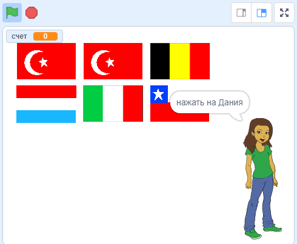

--- no-print ---

Это версия **Скретч 3** проекта. Есть также [Скретч 2 версия проекта](https://projects.raspberrypi.org/ru-RU/projects/guess-the-flag-scratch2).

--- /no-print ---

## Введение

С помощью этих материалов ты создашь викторину на знание флагов, чтобы проверить себя и своих друзей. В этой викторине будут отображаться шесть флагов и название страны, а ты должен нажать на правильный флаг, соответствующий стране.

### Что тебе нужно будет сделать

--- no-print ---

Нажми на флаг нужной страны.

  <iframe allowtransparency="true" width="485" height="402" src="https://scratch.mit.edu/projects/embed/436670934/?autostart=false" frameborder="0" scrolling="no"></iframe>

--- /no-print ---

--- print-only ---

--- /print-only ---

--- collapse ---
---
title: Чему ты научишься
---

+ Как передать сообщение и заставить другие спрайты отвечать на него
+ Как выбрать случайные элементы из списка

--- /collapse ---

--- collapse ---
---
title: Что тебе понадобится
---

### Оборудование

+ Компьютер, на котором можно запустить Скретч 3

### Программное обеспечение

+ Скретч 3 (либо [онлайн-редактор](http://rpf.io/scratchon){:target="_blank"}, либо [автономный редактор (без подключения к Интернету)](http://rpf.io/scratchoff){:target="_blank"})

### Загрузки

+ [Автономный стартовый проект](http://rpf.io/p/ru-RU/guess-the-flag-go){:target="_blank"}

--- /collapse ---

--- collapse ---
---
title: Дополнительные заметки для преподавателей
---

--- no-print ---

Если ты хочешь распечатать этот проект, то воспользуйся [версией для печати](https://projects.raspberrypi.org/ru-RU/projects/guess-the-flag/print).

--- /no-print ---

Ты можешь [скачать ресурсы для этого проекта здесь](http://rpf.io/p/ru-RU/guess-the-flag-go){:target="_blank"}.

Здесь ты можешь найти [завершённый проект](http://rpf.io/p/ru-RU/guess-the-flag-get){:target="_blank"}.

--- /collapse ---