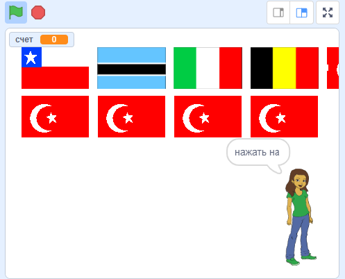

## Начни новый раунд

На данный момент в викторине есть только один раунд, поэтому довольно короткий. Давай добавим несколько раундов.

--- task ---

Создай новую `передачу`{:class="block3events"}, которая отправляет сообщение «Начать раунд».


```blocks3
передать (начать раунд v)
```

--- /task ---

--- task ---

Добавь блок `когда я получу 'Начать раунд'`{:class="block3events"}, а затем перемести весь код из блока `когда зеленый флаг нажат`{:class="block3events"} в этот новый блок.


```blocks3
+когда я получу [начать раунд v]
задать [счет v] значение [0]
создать список флагов :: custom
удалить (все v) из [выбранные флаги v]
повторить (6) раз 
  выбрать случайный флаг :: custom
конец
задать [правильный ответ v] значение (элемент (выдать случайное от (1) до (длина списка [выбранные флаги v])) в [выбранные флаги v])
флаги-клоны :: custom
передать (назвать страну v)
```

--- /task ---

--- task ---

Удали блок `установить значение 0`{:class="block3variables"} и помести его обратно под блок `, когда зеленый флаг нажат`{:class="block3control"}. Затем добавь новый блок `передать`{:class="block3events"} под ними обоими.


```blocks3
when green flag clicked
задать [счет v] значение [0]
передать (начать раунд v)
```

--- /task ---

--- task ---

После кода, который проверяет, верен ли ответ, добавь еще один блок `передать`{:class="block3events"}, чтобы начался новый раунд после ответа на вопрос.


```blocks3
когда спрайт нажат
если <(костюм [имя v]) = (правильный ответ :: variables)> , то 
изменить [счет v] на [1]
  говорить [Правильно] (2) секунд
иначе 
  говорить [К сожалению, неправильно] (2) секунд
конец
+ передать (начать раунд v)
```

--- /task ---

--- task ---

Нажми на зеленый флаг, чтобы проверить код. Нажми на один из флагов, чтобы сыграть раунд. Заметил, что следующий раунд не настроен должным образом?



--- /task ---

Это связано с тем, что перед началом следующего раунда игра должна сначала очистить клонированные флаги.

--- task ---

Создайте еще одну новую `передачу`{:class="block3events"} с именем "очистить".


```blocks3
передать (очистить v)
```

--- /task ---

--- task ---

Установи спрайт флага на `удалить эту копию`{:class="block3control"}, когда он получает команду `очистить`{:class="block3events"}.


```blocks3
когда я получу [очистить]
delete this clone
```

--- /task ---

--- task ---

Помести блок передать `очистить`{:class="block3events"} чуть выше, туда, где игра начинает новый раунд после получения ответа.

```blocks3
когда спрайт нажат
создать список флаги :: custom
if <(item (костюм [номер v] of [флаги]) = (правильный ответ :: variables)> , then 
  говорить [Правильно] (2) секунд
  изменить [счет v] на [1]
иначе 
  говорить [К сожалению, неправильно] (2) секунд
конец
+ передать (очистить v)
передать (начать раунд v)
```

--- /task ---

--- task ---

Протестируй свой код еще раз и убедись, что можно играть в несколько раундов и что счет увеличивается, когда даешь правильные ответы.

--- /task ---

--- task ---

Убедись, что ты скрыл переменную `правильный ответ`{:class="block3variables"}, и что игрок не может ее увидеть!

--- /task ---