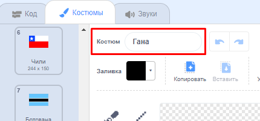
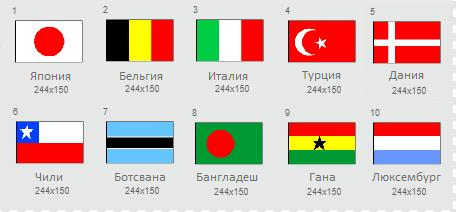

## Нарисуй флаги

--- task ---

Открой стартовый проект "Угадай флаг".

**Онлайн:** открой стартовый проект по адресу [scratch.mit.edu/projects/436671410](https://scratch.mit.edu/projects/436671410){:target="_blank"}. Если у тебя есть аккаунт в Скретче, ты можешь нажать на **Ремикс** в правом верхнем углу онлайн-редактора для сохранения копии проекта.

**Оффлайн**: открой [стартовый проект](https://rpf.io/p/ru-RU/guess-the-flag-go) в оффлайн-редакторе.

Если тебе нужно скачать и установить оффлайн редактор Скретч, ты можешь найти его по адресу [rpf.io/scratchoff](https://rpf.io/scratchoff){:target="_blank"}.

--- /task ---

Выбери вкладку Костюмы. Ты увидишь там восемь флагов.

Прокрути список костюмов вниз, пока не увидишь два пустых костюма. Эти костюмы нужны для того, чтобы ты добавил свои собственные флаги.

--- task ---

Нажмите на костюм 'Твой флаг 1' и измените его имя на название страны.

--- /task ---

--- task ---

Нарисуй флаг этой страны. Убедись, что твой рисунок точно такого же размера, как костюм флага.

Если ты запутался, то можешь найти некоторые флаги на [этом сайте 'Флаги мира'](https://www.countries-ofthe-world.com/flags-of-the-world.html){:target="_blank"}.

--- /task ---

--- task ---

Повтори этот процесс для второго пустого костюма флага, чтобы всего было десять костюмов флагов.

--- /task ---

Вот флаги, которые служат примерами в проекте «Угадай флаг», но ты можешь выбрать любые флаги для своей игры.

