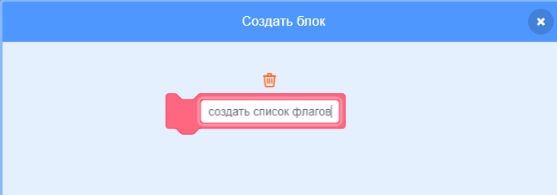

## Создать список флагов

--- task ---

Нажми на вкладку Код. Там есть список под названием `флаги`{:class="block3variables"}, где хранятся названия стран, для которых есть костюмы.

--- /task ---

--- task ---

Добавь еще два блока кода, по одному для двух других созданных тобой флагов, так что в общей сложности в списке `флаги`{:class="block3variables"} должно быть десять блоков.


```blocks3
добавить [Страна] к [флаги v]
```

--- /task ---

--- task ---

Нажми на зеленый флаг и убедись, что страны появились в списке.

--- /task ---

Если нажать на зеленый флаг больше одного раза, страны снова добавляются в список, и в результате получается список из 20 стран вместо 10.

--- task ---

В начале кода добавьте блок `удалить все`{:class="block3variables"} страны в списке прежде чем добавить их. Благодаря этому страны не будут добавляться в список больше одного раза.


```blocks3
когда зеленый флаг нажат
удалить (все v) из [флаги v]
добавить [Япония] к [флаги v]
добавить [Бельгия] к [флаги v]
добавить [Италия] к [флаги v]
добавить [Турция] к [флаги v]
добавить [Дания] к [флаги v]
добавить [Чили] к [флаги v]
добавить [Ботсвана] к [флаги v]
добавить [Бангладеш] к [флаги v]
добавить [Гана] к [флаги v]
добавить [Люксембург] к [флаги v]
```

--- /task ---

Затем создай пользовательский блок. Пользовательский блок - это специальный блок с именем. С помощью этого пользовательского блока ты сможешь создавать список флагов, используя только этот один блок вместо множества блоков.

--- task ---

Нажми на **Мои блоки**, а затем нажми **Создать блок**. Назови твой пользовательский блок `создать список флагов`{:class="block3myblocks"}.




--- /task ---

--- task ---

Перетащи весь код из-под блока `когда флаг нажат`{:class="block3events"} под новый блок `создать список флагов`{:class="block3myblocks"}.

```blocks3
определить создать список флагов
удалить (все v) из [флаги v]
добавить [Япония] к [флаги v]
добавить [Бельгия] к [флаги v]
добавить [Италия] к [флаги v]
добавить [Турция] к [флаги v]
добавить [Дания] к [флаги v]
добавить [Чили] к [флаги v]
добавить [Ботсвана] к [флаги v]
добавить [Бангладеш] к [флаги v]
добавить [Гана] к [флаги v]
добавить [Люксембург] к [флаги v]
```

--- /task ---

--- task ---

Под блоком `когда флаг нажат`{:class="block3events"}, добавь новый блок `создать список флагов`{:class="block3myblocks"}.


```blocks3
когда зеленый флаг нажат
создать список флагов :: пользовательский
```

--- /task ---