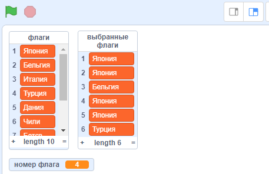

## Выбери случайные флаги

Для каждого раунда викторины выбери шесть случайных флагов из списка ` флаги` {: class = "block3variables"} как варианты ответов.

\--- task \---

Создай еще один список с именем `выбранные флаги`{:class="block3variables"}. В этом списке будут шесть случайных флагов.

\--- /task \---

\--- task \---

Создай переменную с именем `номер флага`{:class="block3variables"}.

\--- /task \---

\--- task \---

Создай пользовательский блок и назови его ` выбрать случайный флаг ` {:class="block3myblocks"}.


```blocks3
определить выбрать случайный флаг
```

\--- /task \---

\--- task \---

Добавь код в пользовательский блок, чтобы установить переменную `номер флага ` {: class = "block3variables"} со случайным числом от ` 1 ` и количество элементов в списке ` флаги` {: class = "block3variables"}.


Во вкладке Переменные есть специальный блок для определения количества элементов в списке.

\--- hints \--- \--- hint \---

Установи переменную ` номер флага` {: class = "block3variables"} на ` случайное число ` {: class = "block3operators"} от ` 1 ` и до ` длина списка флагов ` {:class= "block3variables"}.

\--- /hint \---

\--- hint \---

Вот блоки кода, которые тебе нужны:

```blocks3
(длина списка [флаги v])

(выдать случайное от (1) до (10))

определить cвыбрать случайный флаг

задать [номер флага v] значение []
```

\--- /hint \---

\--- hint \---

Так должен выглядеть твой код:

```blocks3
определить выбрать случайный флаг и 
задать [номер флага v] значение (выдать случайное от (1) до (длина списка [флаги v]))
```

\--- /hint \---

\--- /hints \--- \--- /task \---

Этот блок выбирает элемент из списка по номеру:

```blocks3
(элемент (10 v) в [флаги v])
```

\--- task \---

Объедини этот блок с переменной ` номер флага` {:class="block3variables"}, чтобы получить текст из случайно выбранного элемента из списка ` флаги` {: class="block3variables"}. Затем добавь текст элемента в список` выбранные флаги `{: class = "block3variables"}. Добавь этот код в свой пользовательский блок:


```blocks3
define choose random flag
set [flag number v] to (pick random (1) to (length of [flags v]))
+ add (item (flag number) of [flags v]) to [chosen flags v]
```

\--- /task \---

\--- task \---

Добавь пользовательский блок` выбрать случайный флаг ` {:class="block3myblocks"} к коду, который запускается после нажатия зеленого флажка.


```blocks3
когда зеленый флаг нажат
создать список флагов :: пользовательский
+ выбрать случайный флаг :: пользовательский
```

\--- /task \---

\--- task \---

Протестируй, работает ли твой код, несколько раз щелкнув по зеленому флажку и проверь, добавляются ли разные страны к списку` выбранные флаги ` {: class = "block3variables"} каждый раз. (Если ты скрыл список, поставь галочку рядом с именем списка, чтобы сделать список видимым.)

\--- /task \---

Ты видишь, что, если ты нажимаешь на зеленый флаг много раз, список ` выбранные флаги` {: class = "block3variables"} быстро заполняется более чем шестью элементами?

\--- task \---

Добавь блоки, чтобы удалить все элементы из списка ` выбранные флаги ` {: class = "block3variables"} перед выбором шести флагов для теста.


```blocks3
когда зелёный флаг нажат
создать список флагов :: пользовательский
+ удалить (все v) из [выбранных флагов v]
+ повторить (6) раз
    выбрать случайный флаг :: пользовательский
конец
```

\--- /task \---

\--- task \---

Протестируй свой код еще раз, несколько раз щелкнув по зеленому флагу и убедись, что список ` выбранные флаги ` каждый раз наполняется шестью странами.

\--- /task \---

Ты можешь заметить, что иногда одна и та же страна добавляется в список более одного раза.



\--- task \---

Измени блок ` выбрать случайный флаг ` {: class = "block3myblocks"} так, чтобы одна и та же страна никогда не добавлялась дважды в список `выбранные флаги `{: class = "block3variables"}.

Добавь блок в конец кода пользовательского блока, чтобы удалить `номер флага `{:class="block3variables"} из списка `флаги`{:class="block3variables"} после того, как он будет добавлен в список `выбранные флаги`{:class="block3variables"}.


```blocks3
определить выбрать случайный флаг
задать [номер флага v] значение (выдать случайное от (1) до (длина списка [флаги v]))
добавить (элемент (номер флага) в [флаги v]) в [выбранные флаги v]
+удалить (номер флага) из [флаги v]
```

\--- /task \---

Если ты хочешь скрыть списки и переменные так, чтобы они не занимали место на Сцене, перейдите в раздел «Данные» и снимите флажки рядом с именами списков или именами переменных. Если ты хочешь снова показать списки и переменные, просто снова расставь галочки.