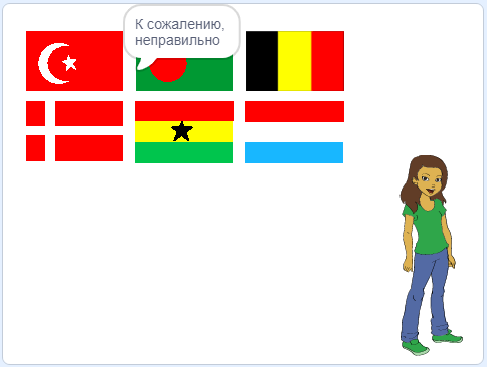

## Проверь ответ

Твой спрайт теперь просит игрока нажать на правильный флаг. Затем игра должна проверить, является ли этот флаг правильным ответом.

--- task ---

Вернись к коду спрайта флага и добавь блок, чтобы начать новый раздел кода, который будет запускаться `когда этот спрайт нажат`{:class="block3events"}.


--- /task ---

Затем твоя викторина должна проверить, совпадает ли имя костюма спрайта флага, который был выбран, с правильным ответом.

--- task ---

Добавь код, который говорит «Правильно», если имя костюма спрайта флага совпадает с `правильный ответ`{:class="block3variables"} или говорит "К сожалению, неправильно", если имя и переменная не совпадают.

Также здесь можно использовать этот полезный блок.

```blocks3
(элемент (10 v) в [флаги v])
```

На этот раз объедини его с блоком `имя костюма`{:class="block3looks"}, чтобы получить имя текущего костюма спрайта флага.


--- hints ---
 --- hint ---

`Когда этот спрайт нажат`{:class="block3events"}, `если`{:class="block3control"} `имя костюма`{:class="block3looks"} совпадает с `правильный ответ`{:class="block3variables"}, `сказать`{:class="block3looks"} 'Правильно', или `иначе`{:class="block3control"} `сказать`{:class="block3looks"} 'К сожалению, неправильно'.

--- /hint ---

--- hint ---

Вот блоки кода, которые тебе нужны:

```blocks3
сказать [К сожалению, неправильно] (2) секунд

сказать [Правильно] (2) секунд

если <>, то 
 
иначе
конец

(костюм [имя v])

<[] = []>

(правильный ответ)

когда спрайт нажат
```

--- /hint ---

--- hint ---

Вот как должен выглядеть твой код:

```blocks3
когда спрайт нажат
если <(костюм [имя v]) = (правильный ответ :: переменные)> , то 
  сказать [Правильно] (2) секунд
иначе 
  сказать [К сожалению, неправильно] (2) секунд
конец
```

--- /hint ---

--- /hints --- --- /task ---

--- task ---

Нажми на зеленый флаг и проверь код дважды: один раз, выбрав правильный флаг, и один раз, выбрав неправильный. Убедись, что появляется правильное сообщение в зависимости от того, даешь ли ты правильный или неправильный ответ.



--- /task ---