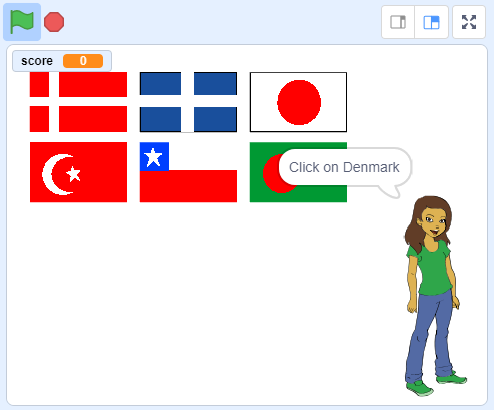

\--- no-print \---

Ово је **Scratch 3** верзија пројекта. Постоји, такође, и [Scratch 2 верзија пројекта](https://projects.raspberrypi.org/en/projects/guess-the-flag-scratch2).

\--- /no-print \---

## Увод

In this resource, you will create a flag quiz to test yourself and your friends. In the quiz, six flags and the name of a country are displayed, and you have to click on the correct flag to match the country.

### Шта ћеш направити

\--- no-print \---

Click on the flag of the country for which you are being asked.

  <iframe allowtransparency="true" width="485" height="402" src="https://scratch.mit.edu/projects/embed/276891625/?autostart=false" frameborder="0" scrolling="no"></iframe>

\--- /no-print \---

\--- print-only \---

\--- /print-only \---

## \--- collapse \---

## title: Шта ћеш научити

+ How to broadcast a message and have other sprites respond
+ How to select random items from a list

\--- /collapse \---

## \--- collapse \---

## title: Шта ће ти бити потребно

* * *

### Хардвер

+ Рачунар који може да покрене Scratch 3

### Софтвер

+ Scratch 3 ([на мрежи](http://rpf.io/scratchon){:target="_blank"} или [ван мреже](http://rpf.io/scratchoff){:target="_blank"})

### Преузимање

+ [Почетни пројекат за уређивач ван мреже](http://rpf.io/p/en/guess-the-flag-go){:target="_blank"}

\--- /collapse \---

## \--- collapse \---

## title: Додатне напомене за наставнике

\--- no-print \---

If you need to print this project, please use the [printer-friendly version](https://projects.raspberrypi.org/en/projects/guess-the-flag/print).

\--- /no-print \---

You can [download the resources for this project here](http://rpf.io/p/en/guess-the-flag-go){:target="_blank"}.

You can find the [completed project here](http://rpf.io/p/en/guess-the-flag-get){:target="_blank"}.

\--- /collapse \---